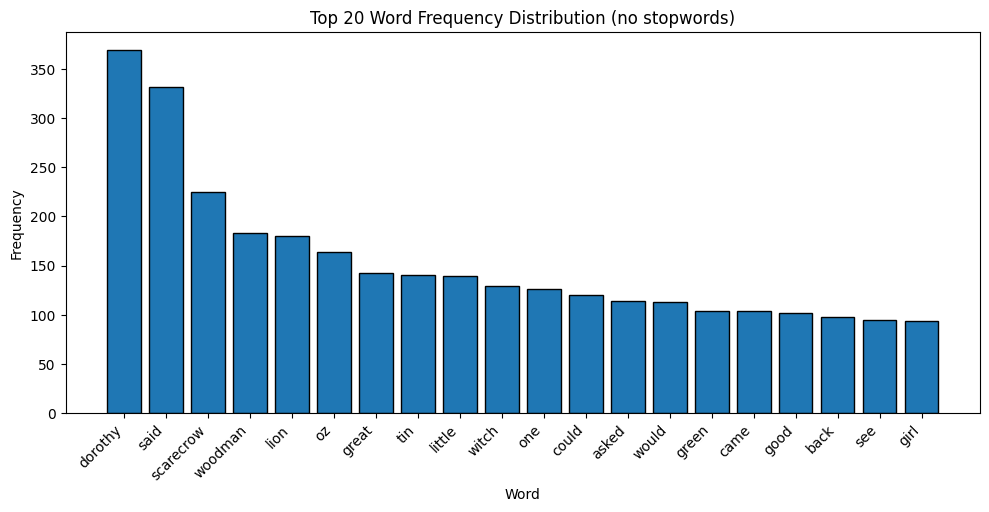
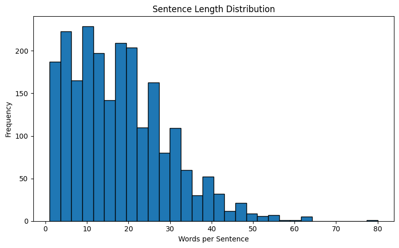

# Regex Text Analytics

A project applying regular expressions to clean, extract, and analyze text from a public domain book.

## What this notebook does
- Downloads and cleans plain text from Project Gutenberg (The Wonderful Wizard of Oz).
- Uses regex to remove headers/footers, normalize punctuation, find chapters, tokenize sentences and words.
- Applies stopword filtering, basic frequency analysis, and a simple Bag-of-Words similarity.
- Produces two visualizations: top words bar chart and sentence-length histogram.

## Dataset
This project uses a public domain text.

| source | key fields |
|---|---|
| Project Gutenberg: The Wonderful Wizard of Oz | sentence, token |

Source URL: https://www.gutenberg.org/cache/epub/55/pg55.txt

## Example regex tasks
- Remove headers/footers: strip Project Gutenberg boilerplate with start/end markers.
- Find chapters: detect chapter headings like “Chapter i the cyclone” using a robust chapter pattern.
- Tokenize sentences: split on end punctuation `[.!?]` while preserving sentence boundaries.
- Tokenize words: match word tokens with `\b\w+\b` for frequency analysis.
- Normalize punctuation: replace smart quotes and collapse whitespace to simplify matching.

## How to run locally
```sh
# clone
git clone https://github.com/f-petrozzi/regex_text_analytics.git
cd regex_text_analytics

# create venv
python -m venv .venv
# Windows
# .\.venv\Scripts\activate
# macOS/Linux
. .venv/bin/activate

# install minimal deps
pip install -r requirements.txt

# open the notebook
# Option A: VS Code + Jupyter extension
#   Open notebooks/regex_work.ipynb and Run All
# Option B: Jupyter Lab/Notebook
jupyter lab
# then open notebooks/regex_work.ipynb
```

## Minimal requirements.txt
```
requests
nltk
pandas
numpy
matplotlib
```

## Visualizations
- 
- 

## Folder structure
```
regex-text-analytics/
    notebooks/
        regex_work.ipynb
    visuals/
        word_frequency.png
        sentence_length.png
    docs/
        data_sources.txt
    README.md
    requirements.txt
```
